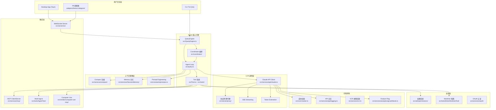

# AI Agent 工程师 Learning Path — cc-haha 项目

> 基于 cchaha 项目
> 目标读者：正在转型大模型/AI Agent 工程师的开发者
> 学习方式：通过精读本项目（一个类 Claude Code 的 AI Agent CLI + Desktop 产品）的核心模块，掌握 AI Agent 工程师 JOB MODEL 所要求的核心能力：12 个 cc-haha 源码精读主题 + RAG、多模态、Python 生态、Fine-tuning 等补充能力
> 预计周期：16-18 周（每周投入 10-15 小时）
> 最后更新：2026-05-09 | 版本：v2.1

## 路线定位与 wiki 对齐

本路线是 cc-haha 源码精读的能力地图，不是完整 API 文档。主线章节 1-12 对应 `wiki/index.md` 的 cc-haha 学习目录；章节 13-15 和附录用于阶段规划、面试速查、Python 迁移与项目外补充能力。

对齐原则：

- `wiki/index.md` 是当前学习状态源；本文件负责说明学习目标、源码入口和练习路径。
- 1-12 章按源码能力项推进：Agent Loop、Tool Calling、MCP、Context/Prompt、Token 优化、Streaming、Memory、Multi-Agent、安全权限、LLMOps、多 Provider、产品化通道。
- RAG、Fine-tuning、Python 生态和 Portfolio 属于补充能力，不要求在 cc-haha 源码中找到完整实现；进入这些主题时再单独建 wiki 页。
- 正常学习笔记只更新 `wiki/`；只有当源码路径或路线目标发生漂移时，才更新本路线文档。

## 0. 项目全局架构

### 0.1 这是一个什么项目

cc-haha 是一个 AI Agent 产品，包含三个层次：

- CLI 终端应用（Bun + React/Ink TUI）：用户在终端与 AI 对话，AI 可以读写文件、执行命令、搜索代码。
- 本地 HTTP/WebSocket 服务（Bun.serve）：为桌面应用提供 API 和实时通信。
- 桌面应用（React + Vite + Tauri 2）：图形化界面，通过 WebSocket 连接本地服务。

### 0.2 技术栈

| 层级 | 技术 | 入口文件 |
| --- | --- | --- |
| CLI | Bun, TypeScript, React 19, Ink 6 | `bin/claude-haha` → `src/entrypoints/cli.tsx` |
| 服务端 | Bun.serve, WebSocket | `src/server/index.ts` |
| 桌面端 | React 18, Vite, Tauri 2, Zustand | `desktop/src/main.tsx` |
| LLM API | `@anthropic-ai/sdk`, SSE streaming | `src/services/api/claude.ts` |
| MCP | `@modelcontextprotocol/sdk` | `src/services/mcp/client.ts` |

### 0.3 架构全景与能力项分布



### 0.4 核心数据流

理解以下数据流是学习整个项目的基础：

```text
用户输入
→ QueryEngine.processUserInput()
→ query() / queryLoop()
← Agent Loop 核心
→ while (true) {
  组装 systemPrompt + messages
  → queryModel()
  ← 调 LLM API（Streaming）
  ← 解析 assistant message
  if (包含 tool_use) {
    → runTools()
    ← 执行工具（需权限检查）
    ← tool_result 追加到 messages
    continue
  } else {
    break
  }
}
```

## 1. Agent Loop 设计

### 1.1 为什么重要

Agent Loop 是 AI Agent 最核心的设计模式，也是面试必考第一题。它决定了 Agent 如何“思考-行动-观察”循环执行任务。2026 年几乎所有 AI Agent 岗位都要求深入理解 ReAct 模式的工程实现。

### 1.2 代码阅读指引

| 顺序 | 文件 | 关注点 |
| --- | --- | --- |
| 1 | `src/query.ts` → `query()`（第 219 行） | 入口函数；注意它是 `async function*` 生成器 |
| 2 | `src/query.ts` → `queryLoop()`（第 241 行）；`while (true)` 在第 307 行 | 核心循环 |
| 3 | `src/query.ts` → `State` 类型（第 204 行） | 跨迭代状态：`messages`, `turnCount`, `autoCompactTracking` |
| 4 | `src/QueryEngine.ts` → `QueryEngine` 类 | 上层封装：用户输入处理 → `query` 调用 → 结果分发 |
| 5 | `src/services/tools/toolOrchestration.ts` → `runTools()` | 工具执行编排：只读工具并发，写入工具串行 |
| 6 | `src/services/tools/StreamingToolExecutor.ts` | 流式工具执行器：边流式接收 LLM 输出边启动工具 |

**带着这些问题读代码：**

1. `queryLoop` 的 `while (true)` 循环在什么条件下终止？找 `return { reason: ... }` 的所有出处。
2. 当 LLM 返回 `tool_use` 时，工具执行结果如何追加到 `messages` 数组并回传给下一轮 LLM？
3. `AsyncGenerator`（`async function*`）相比普通 `async` 函数有什么优势？为什么 Agent Loop 选用这个模式？

**关键设计模式：**

- `AsyncGenerator` 流式管道：`queryLoop` 用 `yield` 逐条输出事件（`StreamEvent`, `Message`），上层消费者按需拉取，天然支持背压和中断。
- 不可变参数 + 可变状态分离：`params` 在循环外解构且不变，`state` 在每次迭代末尾用整体替换更新。
- 多策略恢复：循环内有 `prompt-too-long` 恢复、`max-output-tokens` 恢复、`reactive compact` 等容错路径。

### 1.3 面试准备

**Q：请描述一个 AI Agent 的核心循环是如何实现的？**

回答思路：以 `queryLoop()` 为例说明 ReAct 模式的工程实现。核心是一个 `while (true)` 循环，每次迭代包含上下文组装、调用 LLM API、解析 `tool_use`、执行工具并收集 `tool_result`、将结果追加到 `messages` 进入下一迭代。终止条件包括无 `tool_use`、达到 `maxTurns`、用户中断、Token 预算耗尽。

**Q：为什么用 AsyncGenerator 而不是普通递归或回调？**

回答思路：三个原因：流式输出让思考过程和工具进度可被 UI 实时消费；惰性求值避免无谓缓冲；`using` 语法可以在生成器退出时自动清理资源，例如 `pendingMemoryPrefetch`。

**Q：Agent Loop 中如何处理错误恢复？**

回答思路：项目实现多层恢复策略：`reactiveCompact` 处理 `prompt-too-long`；`max_output_tokens` 恢复会注入 meta message 让模型继续；`FallbackTriggeredError` 触发 fallback model；`contextCollapse` 在 compact 前尝试低成本折叠上下文。

### 1.4 动手练习

**目标：在本项目中添加一个自定义 Tool（如 `CurrentTimeTool`，返回当前时间）**

**步骤：**

1. 阅读 `src/tools/GlobTool/GlobTool.ts`，理解完整 Tool 的结构：`inputSchema`, `call`, `prompt`, `renderToolUseMessage` 等。
2. 在 `src/tools/` 下新建 `CurrentTimeTool/` 目录。
3. 创建 `prompt.ts`，导出工具名和描述文字。
4. 创建 `CurrentTimeTool.ts`，使用 `buildTool()` 构建，定义 Zod `inputSchema`，实现 `call()` 返回时间字符串。
5. 在 `src/tools.ts` 的 `getAllBaseTools()` 中注册工具。
6. 用 `./bin/claude-haha` 启动项目，让 Agent 回答“告诉我现在几点”。

**验证方法：Agent 在对话中调用了 `CurrentTimeTool` 并返回正确时间。**

### 1.5 延伸阅读

- ReAct 论文：ReAct: Synergizing Reasoning and Acting in Language Models (ICLR 2023)
- Anthropic Agent 文档：Building effective agents
- Agentic Design Patterns：Loop、Sequential、Parallel 等模式

## 2. Tool Calling / Function Calling

### 2.1 为什么重要

Tool Calling 是 Agent 从“能说话”进化到“能做事”的关键。2026 年的 AI Agent 工程师必须精通工具定义与 Schema 设计、Zod → JSON Schema 转换、权限控制、并发执行策略，以及动态工具加载（defer loading）来优化 Token 开销。

### 2.2 代码阅读指引

| 顺序 | 文件 | 关注点 |
| --- | --- | --- |
| 1 | `src/Tool.ts` → `Tool` 类型（第 362 行）、`ToolUseContext`（第 158 行） | 完整工具接口：`inputSchema`, `call`, `checkPermissions`, `isConcurrencySafe` 等 |
| 2 | `src/Tool.ts` → `buildTool()`（第 783 行）、`ToolDef`（第 721 行） | 工具构建器；理解 `{ ...TOOL_DEFAULTS, ...def }` 默认值展开模式 |
| 3 | `src/tools.ts` → `getAllBaseTools()`（第 194 行） | 工具注册中心：所有内置工具在这里汇总 |
| 4 | `src/utils/api.ts` → `toolToAPISchema()`（第 119 行） | Zod Schema → Anthropic API `BetaToolUnion` 的转换 |
| 5 | `src/tools/GlobTool/GlobTool.ts` | 完整示例：只读、并发安全的搜索工具 |
| 6 | `src/tools/BashTool/` | 复杂示例：涉及权限、沙箱、危险命令分类 |
| 7 | `src/services/tools/toolOrchestration.ts` → `runTools()`（第 19 行） | 执行编排：只读工具并发，写入工具串行 |

**带着这些问题读代码：**

1. 一个工具从“定义”到“被 LLM 调用”经历哪些步骤？
2. `isConcurrencySafe` 如何影响工具执行策略？哪些工具是安全的，哪些不是？
3. `defer_loading` 和 `ToolSearchTool` 如何配合？为什么不把所有工具都发给 LLM？

### 2.3 面试准备

**Q：如何为 AI Agent 设计一套可扩展的工具系统？**

回答思路：使用 Zod Schema 定义 `inputSchema` 并自动转 JSON Schema；`buildTool()` 提供 fail-closed 默认值；分离 `checkPermissions` 和 `call`；通过 `isConcurrencySafe` 自动编排并发；通过 `shouldDefer` 动态加载工具，避免 Token 浪费。

**Q：如何解决工具数量过多导致的 Token 浪费问题？**

回答思路：项目通过 `defer_loading + ToolSearchTool` 解决。工具过多时非核心工具只暴露名称，不发送完整 schema；当 LLM 需要延迟工具时先调用 `ToolSearchTool` 搜索，下一轮再注入完整 schema。

**Q：工具执行失败时 Agent 如何处理？**

回答思路：`validateInput` 调用前校验参数；`call()` 异常被捕获并转成 `is_error: true` 的 `tool_result`；用户中断时 `StreamingToolExecutor` 会为未完成工具生成合成 `tool_result`，避免 tool_use/tool_result 不配对。

### 2.4 动手练习

**目标：跟踪一个 `GlobTool` 调用的完整生命周期**

**步骤：**

1. 在 `src/tools/GlobTool/GlobTool.ts` 的 `call()` 入口添加 `console.log("GlobTool called:", input)`。
2. 在 `src/services/tools/toolExecution.ts` 的 `runToolUse` 入口添加 `console.log("runToolUse:", toolName)`。
3. 在 `src/utils/api.ts` 的 `toolToAPISchema` 入口添加 `console.log("toolToAPISchema:", tool.name)`。
4. 启动项目，要求 Agent “找出所有 .ts 文件”。
5. 观察日志输出顺序，绘制调用链路图。
6. 完成后清除所有 `console.log`。

**验证方法：能画出 `getAllBaseTools()` → `toolToAPISchema()` → LLM 返回 `tool_use` → `runToolUse()` → `checkPermissions()` → `GlobTool.call()` → `mapToolResultToToolResultBlockParam()` 的完整链路。**

### 2.5 延伸阅读

- Anthropic Tool Use 文档：Tool use with Claude
- Fine-grained Tool Streaming：工具参数流式传输
- JSON Schema 规范：Understanding JSON Schema

### 2.6 结构化输出 (Structured Output)

本项目用一种精妙方式实现结构化输出：不依赖 `response_format` 参数，而是通过 Tool 的 `inputSchema` 间接约束输出格式。

**核心代码：**

| 文件 | 关注点 |
| --- | --- |
| `src/tools/SyntheticOutputTool/SyntheticOutputTool.ts` | 合成输出工具：模型通过“调用工具”来输出结构化 JSON，Schema 由 Ajv 校验 |
| `src/utils/api.ts` → `modelSupportsStructuredOutputs` | 按模型能力决定是否启用 strict tool schema |
| `src/QueryEngine.ts` → SDK 路径中 `jsonSchema` 的处理 | 非交互模式下如何强制结构化输出 |

设计思路：让模型“调用一个工具”来产出结构化数据，比 `response_format: json` 更灵活，可以在同一轮对话中混合自然语言和结构化输出，并兼容不支持 JSON Mode 的模型。

**Q：如何在 Agent 系统中实现可靠的结构化输出？**

回答思路：两种方案分别是 `response_format: json_schema`（OpenAI 风格，强约束但限制行为）和 Tool-as-Schema（Anthropic 风格，用 `tool_use.inputSchema` 约束，更灵活）。本项目采用后者，通过 `SyntheticOutputTool` 让模型“调用”特殊工具，Ajv 校验格式正确。

## 3. MCP 协议 (Model Context Protocol)

### 3.1 为什么重要

MCP 是 2025-2026 年 AI Agent 生态的重要标准化协议，解决 Agent 与外部工具/数据源集成碎片化的问题。掌握 MCP 的客户端和服务端实现是 AI Agent 工程师的硬门槛。

### 3.2 代码阅读指引

| 顺序 | 文件 | 关注点 |
| --- | --- | --- |
| 1 | `src/services/mcp/client.ts` 文件头 import 区 | 三种 Transport：`StdioClientTransport`, `SSEClientTransport`, `StreamableHTTPClientTransport` |
| 2 | `src/services/mcp/client.ts` → `connectToServer()`（第 592 行，`memoize` 包裹） | 连接建立：Transport 选择 → Client 初始化 → capabilities 协商 |
| 3 | `src/services/mcp/client.ts` → `fetchToolsForClient()` | 工具发现：`list_tools` → 转换为本地 Tool 格式 |
| 4 | `src/tools/MCPTool/MCPTool.ts` | 适配器模式：将 MCP 工具桥接为项目的 Tool 接口 |
| 5 | `src/services/mcp/config.ts` | MCP 服务器配置：如何声明一个 MCP Server |
| 6 | `src/entrypoints/mcp.ts` → `startMCPServer()`（第 35 行） | 反向角色：本项目作为 MCP Server 暴露工具 |
| 7 | `src/services/mcp/auth.ts` | OAuth 认证流程：MCP Server 的安全接入 |

**带着这些问题读代码：**

1. 当用户配置新的 MCP Server 时，从配置文件到工具可用经历哪些步骤？
2. MCP 工具和本地工具（如 `GlobTool`）在 Tool 接口层面有什么区别？看 `isMcp` 和 `mcpInfo`。
3. 本项目自身作为 MCP Server 时暴露了哪些工具？暴露方式和作为 Client 消费工具有什么对称性？

### 3.3 面试准备

**Q：解释 MCP 协议的核心架构和通信机制。**

回答思路：MCP 基于 JSON-RPC 2.0，定义 Client 和 Server 两个角色。Client 发起请求，Server 提供工具、资源、提示。支持 Stdio、SSE、Streamable HTTP 三种 Transport。核心交互是 `initialize` 能力协商、`tools/list` 工具发现、`tools/call` 工具调用。

**Q：在本项目中，MCP 的双向性如何体现？**

回答思路：项目同时实现 MCP Client 和 Server。Client 侧连接外部 MCP Server，把远程工具适配为本地 Tool；Server 侧把项目自身工具暴露为 MCP 接口，供其他 AI 应用消费。

### 3.4 动手练习

**目标：编写一个简单 MCP Server 并接入本项目**

**步骤：**

1. 阅读 MCP SDK 文档，理解 Server 的最小实现。
2. 在项目外创建独立 Node/Bun 项目。
3. 使用 `@modelcontextprotocol/sdk` 创建 Stdio Server，暴露 `get_weather(city)` 模拟天气工具。
4. 在项目 MCP 配置中添加该 Server（stdio 类型，指向脚本路径）。
5. 启动 `./bin/claude-haha`，执行 `/mcp` 查看 Server 是否连接成功。
6. 让 Agent 查询城市天气，验证 MCP 工具是否被调用。

**验证方法：Agent 成功通过 MCP 调用自定义 `get_weather` 工具并返回结果。**

### 3.5 延伸阅读

- MCP 官方文档：Model Context Protocol
- MCP GitHub：modelcontextprotocol/modelcontextprotocol
- Anthropic MCP 介绍：Introducing the Model Context Protocol

### 3.6 Computer Use：从文本 Agent 到 GUI Agent

本项目包含完整 Computer Use MCP Server（`src/vendor/computer-use-mcp/`），让 Agent 能操控桌面 GUI：截图、点击、打字、滚动、拖拽。

**核心代码：**

| 文件 | 关注点 |
| --- | --- |
| `src/vendor/computer-use-mcp/tools.ts` | 工具 Schema：`computer_batch`、截图、点击、滚动等 |
| `src/vendor/computer-use-mcp/executor.ts` | 动作执行器：将模型指令转为实际桌面操作 |
| `src/vendor/computer-use-mcp/types.ts` | 坐标模式：像素坐标 vs 归一化百分比（0-100） |
| `src/vendor/computer-use-mcp/deniedApps.ts` / `sentinelApps.ts` | 安全管控：应用黑名单、敏感应用检测 |
| `src/vendor/computer-use-mcp/pixelCompare.ts` | 图像比对：判断截图是否变化 |

**带着这些问题读代码：**

1. 为什么需要两种坐标模式（像素 vs 归一化）？各自适用什么场景？
2. `computer_batch` 如何将多个动作编排为原子操作？
3. 安全管控如何防止 Agent 操控系统偏好设置、终端等敏感应用？

**Q：AI Agent 如何安全地操控桌面 GUI？**

回答思路：Computer Use 的核心挑战是安全。本项目通过 `deniedApps` 黑名单、`sentinelApps` 前台应用检测、`keyBlocklist` 危险按键组合拦截，以及操作前截图比对，确保 Agent “看到”的和实际一致。

### 3.7 MCP vs A2A：Agent 互联的两种范式

| 维度 | MCP (Model Context Protocol) | A2A (Agent-to-Agent Protocol) |
| --- | --- | --- |
| 提出方 | Anthropic | Google |
| 核心定位 | Agent ↔ 工具/数据源 的连接协议 | Agent ↔ Agent 的通信协议 |
| 类比 | AI 世界的 USB 接口 | AI 世界的 HTTP 协议 |
| 交互模式 | Client 调用 Server 暴露的工具 | 对等 Agent 之间发送任务和消息 |
| 本项目实现 | 完整：Client + Server 双向 | 未实现标准 A2A，但 `SendMessageTool + Swarm` 是类似思路 |

**Q：MCP 和 A2A 有什么区别？什么场景用哪个？**

回答思路：MCP 解决“Agent 如何获取外部能力”，通过 `tools/list + tools/call` 发现和调用外部工具；A2A 解决“Agent 如何互相协作”，通过任务委托和消息传递让不同 Agent 分工。未来趋势是 MCP 负责纵向能力扩展，A2A 负责横向 Agent 协作。

- A2A 协议：Agent-to-Agent Protocol
- MCP vs A2A 对比：Understanding A2A and MCP

## 4. Context Engineering / Prompt Engineering

### 4.1 为什么重要

2026 年，行业共识已从 Prompt Engineering 升级为 Context Engineering。不再只是写好一段提示词，而是工程化管理传给 LLM 的所有信息：系统提示词、工具描述、用户上下文、对话历史、附件、记忆注入等。

### 4.2 代码阅读指引

| 顺序 | 文件 | 关注点 |
| --- | --- | --- |
| 1 | `src/constants/prompts.ts` | 系统提示词模板：观察提示词的结构化分层 |
| 2 | `src/context.ts` → `getSystemContext()` / `getUserContext()` | 动态上下文信息收集：OS、cwd、时间等 |
| 3 | `src/utils/queryContext.ts` → `fetchSystemPromptParts()` | 提示词组装：多个来源的提示词片段如何合并 |
| 4 | `src/services/api/claude.ts` → `queryModel()`（第 1017 行） | 最终组装：`systemPrompt + messages + tools` → API 请求 |
| 5 | `src/utils/api.ts` → `prependUserContext()` / `appendSystemContext()` | 上下文注入点：用户上下文前置、系统上下文后置 |
| 6 | `src/tools/AgentTool/prompt.ts` | 子 Agent 的提示词：不同角色如何定制 prompt |
| 7 | `src/utils/effort.ts` | Effort 级别：如何通过参数控制 LLM 思考深度 |

**带着这些问题读代码：**

1. 系统提示词由哪些部分组成？拼接顺序是什么？
2. `userContext` 和 `systemContext` 分别注入到 messages 的什么位置？为什么这样设计？
3. 工具描述如何嵌入上下文？`defer_loading` 工具和正常工具描述有何区别？

### 4.3 面试准备

**Q：在生产级 Agent 中，系统提示词应该如何结构化？**

回答思路：系统提示词可分为 CLI 环境前缀、核心行为指令、工具描述、用户上下文、系统上下文、动态附件（如 `CLAUDE.md`、记忆文件）。分层设计让每层可独立更新，并通过 Prompt Cache 保持稳定前缀。

**Q：什么是 Context Engineering？它和 Prompt Engineering 有什么区别？**

回答思路：Prompt Engineering 关注“写好提示词”；Context Engineering 关注“工程化管理传给 LLM 的所有信息”。本项目涉及动态工具发现、对话历史压缩、记忆按需加载、Token 预算排序、Prompt Cache 优化等。

### 4.4 动手练习

**目标：追踪一次完整 API 调用中系统提示词的组装过程**

**步骤：**

1. 设置 `CLAUDE_CODE_DUMP_PROMPTS=1`（如果项目支持），或在 `src/services/api/claude.ts` 的 `queryModel()` 中打印最终 system prompt 长度和前 500 字符。
2. 启动项目，发送“你好”。
3. 记录系统提示词结构：总长度、各部分占比。
4. 发送“列出当前目录的文件”，对比两次系统提示词差异。
5. 查看 `userContext` 注入了哪些环境信息。

**验证方法：能画出系统提示词层次结构图，并标注各层 Token 占比。**

### 4.5 延伸阅读

- Anthropic Prompt Engineering 指南：Prompt engineering overview
- Context Engineering 概念：AI 软件开发必备 Skill 与 Agent：2026 工程师核心能力图谱
- Claude System Prompt 最佳实践：System prompts

## 5. 上下文窗口管理与 Token 优化

### 5.1 为什么重要

上下文窗口是 Agent 的“工作记忆”，有限且昂贵。生产级 Agent 必须精细管理 Token 预算：何时压缩、如何压缩、如何利用 Prompt Cache 降低成本。

### 5.2 代码阅读指引

| 顺序 | 文件 | 关注点 |
| --- | --- | --- |
| 1 | `src/services/compact/autoCompact.ts` → `getEffectiveContextWindowSize()`（第 33 行） | 入口：如何计算“何时需要压缩” |
| 2 | `src/query.ts` 中搜索 `autocompact` | 压缩在 Agent Loop 中的调用时机 |
| 3 | `src/services/compact/compact.ts` → `compactConversation()`（第 387 行） | 核心压缩：将完整对话历史压缩为摘要 |
| 4 | `src/services/compact/microCompact.ts` | 轻量压缩：针对工具输出的细粒度压缩 |
| 5 | `src/services/compact/reactiveCompact.ts` | 被动压缩：API 报 `prompt-too-long` 时的应急压缩 |
| 6 | `src/services/tokenEstimation.ts` | Token 计数：如何估算消息 Token 数量 |
| 7 | `src/services/api/promptCacheBreakDetection.ts` | Cache 监控：检测 Prompt Cache 命中率下降 |

**带着这些问题读代码：**

1. autoCompact 的触发阈值如何计算？有效窗口 = 模型窗口 - 预留输出空间。
2. `compact` 和 `microCompact` 的区别是什么？什么场景用哪个？
3. `cache_creation_input_tokens` 和 `cache_read_input_tokens` 分别代表什么？为什么 Cache 命中率重要？

### 5.3 面试准备

**Q：如何管理 AI Agent 的上下文窗口？**

回答思路：本项目实现多层压缩策略：`autoCompact` 主动摘要，`microCompact` 裁剪冗长工具输出，`snipCompact` 移除不再需要的中间结果，`reactiveCompact` 处理 API 报错，`contextCollapse` 折叠多轮搜索/读取操作。

**Q：什么是 Prompt Cache？如何优化命中率？**

回答思路：Anthropic Prompt Cache 允许重复 prompt 前缀跨请求复用，命中时 `cache_read_input_tokens` 成本显著低于 `cache_creation_input_tokens`。优化关键是保持系统提示词和工具 schema 顺序稳定，并在 compact 后尽量复用结构。

### 5.4 动手练习

**目标：观察 autoCompact 的触发过程**

**步骤：**

1. 设置较小上下文窗口，例如 `CLAUDE_CODE_AUTO_COMPACT_WINDOW=8000`。
2. 启动项目，进行较长对话，让 Agent 读几个文件、搜索代码。
3. 观察 autoCompact 何时触发。
4. 触发后，对比压缩前后 `messages` 数组长度和内容变化。
5. 记录 `compactionUsage`，即压缩本身消耗的 Token。

**验证方法：能描述 autoCompact 的完整触发流程：阈值计算、压缩执行、压缩后消息重建。**

### 5.5 延伸阅读

- Anthropic Prompt Caching：Prompt caching
- Token 计数指南：Token counting

## 6. Streaming 与实时交互

### 6.1 为什么重要

流式输出让用户看到 Agent 实时思考过程，是优秀 AI 产品体验的基础。从 SSE 协议解析、增量文本渲染到流式工具执行，Streaming 涉及前后端全链路。

### 6.2 代码阅读指引

| 顺序 | 文件 | 关注点 |
| --- | --- | --- |
| 1 | `src/services/api/claude.ts` → `queryModelWithStreaming()`（第 752 行） | 流式 API 调用入口 |
| 2 | `src/services/api/claude.ts` → `queryModel()`（第 1017 行）内的 SSE 事件处理循环 | `message_start` → `content_block_delta` → `message_delta` |
| 3 | `src/services/api/claude.ts` → 流式空闲超时看门狗 | 如何检测和处理挂起的流 |
| 4 | `src/services/api/claude.ts` → `updateUsage()`（第 2924 行） | 流式 usage 的累计逻辑；注意 usage 是累计值不是增量 |
| 5 | `src/services/tools/StreamingToolExecutor.ts`（第 40 行） | 边流式接收边执行工具的优化 |
| 6 | `src/server/ws/handler.ts` | WebSocket 层：CLI → Server → Desktop 的事件转发 |

**带着这些问题读代码：**

1. 一条流式消息经历几层传递？LLM API → SSE → AsyncGenerator → WebSocket → Desktop UI。
2. 流式超时看门狗的工作原理是什么？为什么需要它？
3. `StreamingToolExecutor` 如何做到边流式接收边执行工具？和等消息完整再执行有什么性能差异？

### 6.3 面试准备

**Q：描述一个 AI Agent 的流式输出架构。**

回答思路：三层流式架构：SSE 层接收 Anthropic API 事件；AsyncGenerator 层逐个 `yield StreamEvent`；WebSocket 层将事件推送到桌面客户端。三层解耦后，每层可独立处理背压、超时和错误。

**Q：如何处理流式连接异常？**

回答思路：项目实现流式空闲超时看门狗。SSE 流超过 `STREAM_IDLE_TIMEOUT_MS`（默认 90 秒）无新 chunk 时主动 abort 并重试；还包括半超时警告和 stall 检测，避免会话静默挂起。

### 6.4 动手练习

**目标：追踪一条流式消息从 API 到 UI 的完整路径**

**步骤：**

1. 在 `src/services/api/claude.ts` 的 SSE 事件处理循环中，为 `message_start`, `content_block_start`, `content_block_delta`, `message_delta` 添加日志。
2. 启动项目，发送一条消息。
3. 记录每种事件出现的顺序和频率。
4. 关注 `content_block_delta.text_delta` 如何增量拼接成完整文本。

**验证方法：能画出一条消息从 API SSE 事件到最终屏幕渲染的完整数据流图。**

### 6.5 延伸阅读

- Anthropic Streaming 文档：Streaming Messages
- Server-Sent Events 规范：MDN: Server-Sent Events

## 7. 记忆系统 (Memory)

### 7.1 为什么重要

记忆让 Agent 从“一次性对话”进化到“持续协作”。短期记忆、工作记忆、长期记忆的分层设计，直接影响 Agent 的智能程度和用户体验。

### 7.2 代码阅读指引

| 顺序 | 文件 | 关注点 |
| --- | --- | --- |
| 1 | `src/services/SessionMemory/sessionMemory.ts` | 会话记忆核心：什么信息被记住 |
| 2 | `src/services/SessionMemory/prompts.ts` | 记忆提取使用的提示词 |
| 3 | `src/services/extractMemories/` | 自动记忆提取：从对话中识别值得记住的信息 |
| 4 | `src/services/compact/sessionMemoryCompact.ts` | compact 时如何保存记忆到持久层 |
| 5 | `src/memdir/` | 记忆目录系统：文件系统级持久化 |
| 6 | `src/tools/AgentTool/agentMemory.ts` | Agent 级记忆：子 Agent 的记忆隔离 |
| 7 | `src/query.ts` 中搜索 `pendingMemoryPrefetch` | 记忆预取：在 LLM 推理时并行加载相关记忆 |

**带着这些问题读代码：**

1. 记忆三层架构（上下文内 → compact 摘要 → 持久化 memdir）之间如何转换？
2. `pendingMemoryPrefetch` 如何不阻塞 Agent Loop 地预取相关记忆？
3. 子 Agent 的记忆和主 Agent 的记忆是共享还是隔离？

### 7.3 面试准备

**Q：如何为 AI Agent 设计记忆系统？**

回答思路：分三层：短期记忆是当前 `messages`；工作记忆是 compact 生成的对话摘要；长期记忆由 `extractMemories` 从对话中提取结构化信息并持久化到 memdir。新会话或 compact 后通过 memory prefetch 按需加载相关记忆。

**Q：记忆预取如何实现非阻塞加载？**

回答思路：每轮 Agent Loop 开始时启动异步记忆检索。prefetch 使用 `using` 声明，在后续位置检查是否完成；完成则注入 messages，未完成则跳过并在下一轮重试。

### 7.4 动手练习

**目标：理解记忆的生命周期**

**步骤：**

1. 找到项目 memdir 路径。
2. 查看当前已有记忆文件。
3. 进行一次有意义对话，例如“我偏好用 TypeScript，请记住”。
4. 触发 compact（使用 `/compact` 或等待自动触发）。
5. 再次查看 memdir，观察新增记忆文件。
6. 在新会话中验证记忆是否被加载。

**验证方法：能描述记忆从对话产生、持久化、再到新会话召回的完整生命周期。**

### 7.5 延伸阅读

- Building AI Agents with Memory
- MemGPT: Towards LLMs as Operating Systems

## 8. 多 Agent 协同 (Multi-Agent)

### 8.1 为什么重要

复杂任务往往需要多个 Agent 分工协作。Multi-Agent 系统涉及任务分解、上下文共享与隔离、消息传递、并行执行和结果汇总，是 2026 年高级 Agent 工程师的核心能力。

### 8.2 代码阅读指引

| 顺序 | 文件 | 关注点 |
| --- | --- | --- |
| 1 | `src/tools/AgentTool/runAgent.ts` → `runAgent()`（第 248 行） | 子 Agent 的完整生命周期 |
| 2 | `src/tools/AgentTool/forkSubagent.ts` | Fork 模式：共享父 Agent 上下文的分叉 |
| 3 | `src/tools/AgentTool/loadAgentsDir.ts` | 自定义 Agent 加载：从目录读取 Agent 定义 |
| 4 | `src/tools/AgentTool/builtInAgents.ts` | 内置 Agent 定义 |
| 5 | `src/utils/swarm/inProcessRunner.ts` → `runInProcessTeammate()` | Swarm 模式：进程内多 Agent 协同 |
| 6 | `src/tools/SendMessageTool/` | Agent 间消息传递 |
| 7 | `src/tools/TeamCreateTool/` | 团队创建与管理 |

**带着这些问题读代码：**

1. 子 Agent 和父 Agent 共享什么？隔离什么？
2. `forkSubagent` 和 `runAgent` 的区别是什么？什么场景用 fork？
3. Swarm 模式下多个 Agent 如何协调？是有 Leader 还是完全对等？

### 8.3 面试准备

**Q：如何设计一个 Multi-Agent 系统？**

回答思路：本项目实现两种模式：主-从模式中父 Agent 通过 `runAgent()` 创建子 Agent，子 Agent 拥有独立 messages 和 toolUseContext，但共享 `query()` 引擎；Swarm 模式中多个 Agent 在同一进程并行执行，通过 `SendMessageTool` 通信，由 Leader 协调任务。

**Q：子 Agent 的上下文如何管理？**

回答思路：子 Agent 通过 `createSubagentContext()` 创建独立 `toolUseContext`，包含独立 abortController、readFileState、agentId；共享全局 app state 和 MCP 连接；对话记录写入独立 sidechain transcript。

### 8.4 动手练习

**目标：理解子 Agent 的创建和执行流程**

**步骤：**

1. 在对话中要求 Agent 执行会触发子 Agent 的任务，例如“帮我搜索所有 TODO 并写一个总结”。
2. 观察日志中 `runAgent` 的调用。
3. 在 `runAgent()` 入口添加日志，打印子 Agent 的 `agentDefinition.agentType` 和 `promptMessages` 数量。
4. 对比父 Agent 与子 Agent 的 `toolUseContext.tools` 差异。
5. 查看 sidechain transcript，理解子 Agent 对话如何记录。

**验证方法：能画出父 Agent 调用子 Agent 的时序图，包括上下文创建、`query` 调用、结果回传。**

### 8.5 延伸阅读

- AI Agent Orchestration Patterns (Microsoft)
- A2A 协议：Agent-to-Agent Protocol

### 8.6 Coordinator 模式：高级多 Agent 编排

除了主-从模式和 Swarm 模式，项目还实现 Coordinator 模式：一个带阶段划分、并行 Worker 调度、验证环节的协调者架构。

**核心代码：**

| 文件 | 关注点 |
| --- | --- |
| `src/coordinator/coordinatorMode.ts` | Coordinator 系统提示：规划 → 并行执行 → 验证；Worker 调度策略 |
| `src/utils/agentContext.ts` | AsyncLocalStorage 实现跨并发子 Agent 的归因追踪 |
| `src/tools/shared/spawnMultiAgent.ts` | 多后端 spawn：分屏、进程内等并发模式 |
| `src/utils/swarm/permissionSync.ts` | 并发 Agent 间的权限同步（邮箱转发机制） |

| 维度 | 主-从模式 (AgentTool) | Swarm 模式 | Coordinator 模式 |
| --- | --- | --- | --- |
| 拓扑 | 父 → 子，树状 | 对等，网状 | 协调者 → Worker，星状 |
| 任务分配 | 父 Agent 显式创建子任务 | Leader 协调，`SendMessage` 互通 | Coordinator 按阶段分发 |
| 并发度 | 子 Agent 串行 | 进程内并行 | 阶段内 Worker 并行 |
| 适用场景 | 简单任务委托 | 多角色协作 | 复杂项目级任务 |

**Q：如何编排多个 Agent 处理复杂项目级任务？**

回答思路：采用 Coordinator 模式：规划阶段拆解可并行子任务；执行阶段用 `spawnMultiAgent` 分配给独立 Worker，必要时在独立 worktree 工作；验证阶段检查并合并结果。关键工程挑战是 AsyncLocalStorage 日志归因、permissionSync 权限转发、工作目录和上下文隔离。

## 9. 安全、权限与沙箱

### 9.1 为什么重要

AI Agent 能执行代码、读写文件、发送网络请求，权限不当会造成严重后果。安全与权限控制是 Agent 产品化落地的硬性前提。

### 9.2 代码阅读指引

| 顺序 | 文件 | 关注点 |
| --- | --- | --- |
| 1 | `src/utils/permissions/PermissionMode.ts` | 三种权限模式：`default` / `plan` / `yolo`（`bypassPermissions`） |
| 2 | `src/utils/permissions/permissions.ts` | 权限检查主逻辑：`checkPermissions()` |
| 3 | `src/utils/permissions/bashClassifier.ts` → `classifyBashCommand()`（第 40 行） | Bash 命令危险性分类器 |
| 4 | `src/utils/permissions/dangerousPatterns.ts` | 危险命令模式定义：`rm -rf`, `chmod 777` 等 |
| 5 | `src/utils/permissions/yoloClassifier.ts` | YOLO 模式下的自动安全分类器 |
| 6 | `src/utils/permissions/shellRuleMatching.ts` | Shell 命令与规则模式匹配 |
| 7 | `src/services/mcp/channelPermissions.ts` | MCP 工具的权限管控 |

**带着这些问题读代码：**

1. 权限检查的三层模型是什么？命令分类 → 规则匹配 → 用户确认。
2. 什么命令在 YOLO 模式下仍会被拦截？
3. MCP 工具和本地工具的权限模型有什么区别？

### 9.3 面试准备

**Q：如何为 AI Agent 设计安全的权限系统？**

回答思路：三层递进模型：`bashClassifier` 分类命令安全级别；用户规则 `alwaysAllowRules / alwaysDenyRules / alwaysAskRules` 做模式匹配；未覆盖的写入/危险操作弹 UI 询问。全局模式包括 default、plan、yolo。

**Q：YOLO 模式如何在“方便”和“安全”之间平衡？**

回答思路：YOLO 并非完全禁用安全检查，而是用 `yoloClassifier` 自动审核。日常操作自动放行，高危命令（递归删除、权限修改、网络发送等）仍需确认或拦截。

### 9.4 动手练习

**目标：理解权限检查的完整流程**

**步骤：**

1. 以默认模式启动项目。
2. 让 Agent 执行 `ls -la`，观察是否自动放行。
3. 让 Agent 执行 `rm -rf /tmp/test`，观察权限提示。
4. 阅读 `src/utils/permissions/bashClassifier.ts`，理解 `ls` 和 `rm -rf` 的分类。
5. 配置一条 `alwaysAllowRules`，例如允许 `Bash(echo *)`，验证规则生效。

**验证方法：能解释为什么 `ls` 自动通过而 `rm -rf` 需要确认，以及规则如何覆盖默认行为。**

### 9.5 延伸阅读

- The Complete Agentic AI System Design Interview Guide 2026
- OWASP Top 10 for LLM Applications

### 9.6 Worktree 隔离：环境级安全沙箱

除了命令级权限控制，项目还通过 Git Worktree 为 Agent 创建独立工作目录，使实验性修改不污染主分支。

| 文件 | 关注点 |
| --- | --- |
| `src/tools/EnterWorktreeTool/EnterWorktreeTool.ts` | 创建 worktree、切换 cwd、清除提示词缓存 |
| `src/tools/ExitWorktreeTool/ExitWorktreeTool.ts` | 退出 worktree、恢复原始目录 |
| `src/utils/worktree.ts` | Worktree 管理：创建、验证 slug、会话绑定 |

**为什么这个设计很重要：**

- best-of-N 并行尝试：多个子 Agent 在各自 worktree 分支上尝试不同方案。
- 安全实验：Agent 可以大胆改代码而不影响用户工作目录。
- 原子回滚：失败实验只需删除 worktree，无需 `git reset`。

**Q：如何让 Agent 安全地做代码实验？**

回答思路：两层隔离：Git Worktree 提供独立工作目录和分支；权限系统在 worktree 内仍生效。这样支持 best-of-N 策略，由 Coordinator 比较结果后选优合并。

## 10. LLMOps / 可观测性

### 10.1 为什么重要

生产级 Agent 需要答得好、跑得快、花得少。LLMOps 覆盖 API 监控（TTFT、OTPS）、Token 追踪、成本管理、错误恢复、A/B 测试等全链路可观测能力。

### 10.2 代码阅读指引

| 顺序 | 文件 | 关注点 |
| --- | --- | --- |
| 1 | `src/cost-tracker.ts` | 成本追踪：`getTotalCost()`, `getModelUsage()` |
| 2 | `src/services/api/logging.ts` | API 日志：TTFT、OTPS |
| 3 | `src/services/api/usage.ts` | API 用量统计 |
| 4 | `src/services/api/withRetry.ts` | 重试机制：指数退避、模型降级 |
| 5 | `src/services/vcr.ts` | VCR 模式：录制和回放 API 交互 |
| 6 | `src/services/diagnosticTracking.ts` | 诊断追踪 |
| 7 | `src/services/analytics/` | 分析和 Feature Flag（GrowthBook） |
| 8 | `src/services/rateLimitMessages.ts` | 限流消息处理 |

**带着这些问题读代码：**

1. VCR 模式如何录制 API 请求/响应？录制文件在哪里？如何回放？
2. API 返回 429 时系统如何处理？重试策略是什么？
3. 成本追踪是实时的吗？如何计算一次对话总花费？

### 10.3 面试准备

**Q：如何监控和优化 AI Agent 的性能和成本？**

回答思路：监控维度包括 TTFT 和 OTPS 延迟指标、基于 API usage 的实时成本追踪、指数退避和 fallback model 重试、VCR 录制回放用于离线调试。

**Q：什么是 VCR 模式？在 Agent 开发中有什么价值？**

回答思路：VCR 会录制 LLM API 的完整请求和响应到本地文件。回放时无需真实 API 调用，带来确定性调试、节省成本、离线开发能力。

### 10.4 动手练习

**目标：理解成本追踪和 API 监控**

**步骤：**

1. 启动项目，进行几轮对话。
2. 使用 `/cost` 命令或查看 `cost-tracker.ts` 输出。
3. 关注 `cache_creation_input_tokens` vs `cache_read_input_tokens`。
4. 计算 Prompt Cache 命中率：`cache_read / (cache_read + cache_creation)`。
5. 阅读 `withRetry.ts`，理解何时重试、最多重试几次。

**验证方法：能解读一次会话的 API usage 报告，计算总成本，并指出 Prompt Cache 优化效果。**

### 10.5 延伸阅读

- Anthropic API Usage：Messages API usage
- LLMOps 实践：Agent Loop、Context Engineering、Tools 注册

### 10.6 Feature Flag 与灰度发布

生产级 Agent 不能“发版一刀切”。新 Prompt、新工具、新模型都需要灰度验证。项目集成 GrowthBook，实现特性开关和 A/B 测试框架。

| 文件 | 关注点 |
| --- | --- |
| `src/services/analytics/growthbook.ts` | GrowthBook 客户端：用户属性 → 特性开关 → 实验曝光日志 |
| `src/services/analytics/config.ts` | 分析系统配置 |
| `src/services/analytics/datadog.ts` | Datadog 集成：性能指标上报 |
| `src/services/analytics/sink.ts` / `sinkKillswitch.ts` | 事件汇集层 + 紧急关停开关 |

**带着这些问题读代码：**

1. `GrowthBookUserAttributes` 包含哪些维度？如何实现按组织灰度？
2. `sinkKillswitch` 的作用是什么？为什么分析系统需要紧急关停？
3. Feature Flag 如何与 `useMainLoopModel` 配合，实现按灰度切换模型？

**Q：如何安全地为 Agent 灰度发布新功能？**

回答思路：通过 Feature Flag 按用户、组织、平台分批放开新 Prompt；按开关控制新工具是否可见；按实验组切换模型。曝光日志结合 Datadog 性能指标形成闭环。

### 10.7 Agent 评估方法论（2026 核心能力）

“没有度量，就没有改进”。Agent 输出质量评估比传统软件测试复杂：输出是概率性的、多维度、上下文依赖。2026 年行业共识是评测成为 Agent 系统的控制平面。

**项目中已有的评估基础设施：**

| 工具 | 用途 | 文件 |
| --- | --- | --- |
| VCR 录制回放 | 录制 API 请求/响应，离线确定性回放 | `src/services/vcr.ts` |
| Prompt Cache 监控 | 检测 prompt 变更导致的缓存失效 | `src/services/api/promptCacheBreakDetection.ts` |
| 成本追踪 | 逐请求计费，计算 ROI | `src/cost-tracker.ts` |
| 性能日志 | TTFT、OTPS 等延迟指标 | `src/services/api/logging.ts` |

**Agent 评估金字塔：**

| 层级 | 方式 | 定位 |
| --- | --- | --- |
| Level 4 | 人工评估 | 最贵，复杂场景的最终裁判 |
| Level 3 | LLM-as-Judge | 用更强模型自动化评分 |
| Level 2 | VCR / Golden Set | 录制回放 + 确定性断言 |
| Level 1 | 单元 / 快照测试 | 最便宜，Schema 校验、格式检查 |

**2026 年主流评测框架：**

| 框架 | 定位 | 核心能力 | 适用场景 |
| --- | --- | --- | --- |
| MLflow | 全栈平台（3000 万+月下载） | Trace 级评分、Agent GPA、LLM Judge 对齐 | 企业级全链路评测 |
| agentevals (Solo.io) | OTel 原生（2026.3 发布） | Golden Set 对照、轨迹匹配、MCP Server 集成 | 分布式 Agent 系统评测 |
| DeepEval | pytest 原生 CI/CD 集成 | 50+ 预置指标、Span 级评估 | 已用 pytest 的团队 |
| Ragas | 研究驱动 RAG + Agent | Faithfulness、Relevancy、AgentGoalAccuracy | RAG 管线专项评测 |

**闭环改进（Closed-Loop Improvement）：**

```text
Planner(规划) → Simulator(模拟执行) → Evaluator(LLM-as-Judge 评分)
                         ↓
                    不合格 → Refine(优化 Prompt/工具/策略)
                         ↓
                    合格 → Deploy(发布)
```

- 系统优化周期从“数周人工调试”缩短为“数小时自动迭代”。
- 通过 agentevals MCP Server，Claude Code 等 Agent 可以直接运行评测。
- Hallucination Rate 和 Tool Selection Accuracy 是最重要的评测指标。
- 采用评测驱动的团队输出一致性提升可达 40%。

**Q：如何评估 AI Agent 的输出质量？**

回答思路：使用四层评估体系：单元测试校验工具输入输出和格式转换；VCR 回归测试录制真实 API 交互并离线回放；LLM-as-Judge 评估主观质量；复杂场景保留人工评估。

**Q：如何搭建 Agent 持续评测流水线？**

回答思路：先从历史成功会话构建 50-200 个 Golden Set；CI/CD 中每次 Prompt 或工具变更触发 DeepEval/agentevals 回归测试；线上通过 OTel tracing 持续监控质量；评估结果反馈到 Prompt 优化。

### 10.8 延伸阅读

- Anthropic 评估指南：Evaluating AI outputs
- LLM-as-Judge：Judging LLM-as-a-Judge
- agentevals GitHub
- MLflow Agent Evaluation

## 11. 多 Provider 与模型路由

### 11.1 为什么重要

2026 年企业级 Agent 几乎不可能只用一个 LLM Provider。团队需要在 Anthropic、OpenAI、开源模型之间灵活切换，用于成本、合规和容灾。

### 11.2 代码阅读指引

| 顺序 | 文件 | 关注点 |
| --- | --- | --- |
| 1 | `src/utils/model/providers.ts` | 四种 Provider：`firstParty`, `bedrock`, `vertex`, `foundry` |
| 2 | `src/utils/model/modelCapabilities.ts` | 动态模型能力发现：获取 `max_input_tokens` / `max_tokens` 并本地缓存 |
| 3 | `src/utils/model/aliases.ts` / `configs.ts` | 模型别名系统、默认配置 |
| 4 | `src/server/proxy/handler.ts` | 协议转换代理：Anthropic → OpenAI Chat/Responses，含流式映射 |
| 5 | `src/server/proxy/transform/anthropicToOpenaiChat.ts` | 请求转换：system prompt、messages、tool_use → tool_calls、image 格式 |
| 6 | `src/server/proxy/streaming/openaiChatStreamToAnthropic.ts` | 流式响应转换：OpenAI SSE → Anthropic SSE 事件 |
| 7 | `src/services/api/withRetry.ts` | Fallback 降级：主模型失败时切换备用模型 |
| 8 | `src/utils/effort.ts` | Effort 级别：控制思考深度，间接影响模型选择 |

**带着这些问题读代码：**

1. Anthropic 和 OpenAI 的 Tool Use 格式差异是什么？`anthropicToOpenaiChat.ts` 如何映射？
2. 流式响应格式转换有什么挑战？增量 delta vs 完整 block。
3. `modelCapabilities.ts` 如何用最长前缀匹配查找模型能力？为什么这样设计？

### 11.3 面试准备

**Q：如何设计一个支持多 LLM Provider 的 Agent 系统？**

回答思路：内部统一使用 Anthropic Messages 格式，外部通过 Proxy 适配其他 Provider。`providers.ts` 选择 Provider，`proxy/handler.ts` 双向协议转换，`modelCapabilities.ts` 动态获取模型能力并缓存。这样 Agent Loop 和 Tool 系统不感知 Provider 差异。

**Q：Anthropic 和 OpenAI 的 API 在 Tool Use 上有什么区别？**

回答思路：Anthropic 用 content 数组中的 `tool_use` block；OpenAI 用 `tool_calls` 数组。结果返回方面 Anthropic 用 `tool_result`，OpenAI 用 `tool` role。图像格式也不同：Anthropic 用 base64 source，OpenAI 用 data URL。

### 11.4 动手练习

**目标：理解协议转换层的工作方式**

**步骤：**

1. 阅读 `src/server/proxy/transform/types.ts`，理解 Anthropic 和 OpenAI 类型定义。
2. 对比 `AnthropicMessage` 和 `OpenAIChatMessage` 的结构差异。
3. 在 `anthropicToOpenaiChat.ts` 中追踪包含 `tool_use` 的 assistant message 转换过程。
4. 查看 `src/server/__tests__/proxy-transform.test.ts`，理解边界情况处理。
5. 可选：配置 OpenAI 兼容 Provider（如 Ollama），通过 proxy 接入项目。

**验证方法：能画出 Anthropic Messages 请求 → OpenAI Chat Completions 请求的完整字段映射图。**

### 11.5 延伸阅读

- Anthropic Messages API Reference
- OpenAI Chat Completions API
- LiteLLM：开源多 Provider 适配层

## 12. Agent 产品化：多通道接入

### 12.1 为什么重要

实际产品需要接入飞书、钉钉、Telegram、Web 等多个通道。通道适配层、并发会话、附件处理和流式消息映射，是 Agent 产品化落地的关键工程挑战。

### 12.2 代码阅读指引

| 顺序 | 文件 | 关注点 |
| --- | --- | --- |
| 1 | `adapters/README.md` | 适配层架构总览：Desktop → API → adapters → WS → session |
| 2 | `adapters/common/ws-bridge.ts` | WebSocket Bridge：自动重连、心跳、FIFO 消息序列化 |
| 3 | `adapters/common/chat-queue.ts` | 并发会话队列管理 |
| 4 | `adapters/common/message-dedup.ts` | 消息去重：防止 IM 平台重发导致重复处理 |
| 5 | `adapters/common/attachment/` | 跨平台附件抽象：`AttachmentRef`、大小限制、`ImageBlockWatcher` |
| 6 | `adapters/feishu/index.ts` | 飞书适配器：Lark WSClient → WsBridge → Claude 会话 |
| 7 | `adapters/feishu/streaming-card.ts` | 流式卡片：将 Agent 流式输出映射到飞书 CardKit |
| 8 | `adapters/telegram/index.ts` | Telegram 适配器：grammy Bot API 封装 |

**带着这些问题读代码：**

1. `WsBridge` 的重连策略是什么？指数退避、最大重试次数、心跳间隔如何设置？
2. 为什么需要 `chat-queue`？用户连续发送多条消息时如何处理？
3. `ImageBlockWatcher` 如何检测 Agent 输出中的图片引用并自动上传到 IM 平台？
4. 飞书和 Telegram 适配器共享哪些 `common/` 逻辑，各自定制什么？

### 12.3 面试准备

**Q：如何让 AI Agent 接入企业 IM（如飞书、钉钉）？**

回答思路：分三层：通用适配层包含 WsBridge、ChatQueue、MessageDedup、AttachmentRef；平台适配层处理飞书 CardKit、Telegram 纯文本、媒体上传等差异；会话桥接把 IM 消息通过 WebSocket 转入 Claude Code Session 和 Agent Loop。

**Q：IM 适配中有哪些常见工程挑战？**

回答思路：消息去重、并发控制、附件格式统一、流式输出映射、连接稳定性。Agent 核心应不感知通道差异，新增通道只实现平台适配层。

### 12.4 动手练习

**目标：理解 IM 适配层架构**

**步骤：**

1. 阅读 `adapters/common/ws-bridge.ts`，画出连接 → 心跳 → 断连 → 重连状态机。
2. 阅读 `adapters/feishu/index.ts`，追踪一条飞书消息从接收到 Agent 回复的链路。
3. 查看 `adapters/common/attachment/image-block-watcher.ts`，理解 Markdown 图片引用检测。
4. 运行 `cd adapters && bun test` 查看测试覆盖。
5. 可选：为 Discord 写一个最小适配器。

**验证方法：能画出飞书消息从用户发送到 Agent 回复展示在飞书卡片的完整时序图。**

### 12.5 延伸阅读

- 飞书开放平台：IM Bot 开发指南
- grammy.dev：Telegram Bot 框架
- Adapter Pattern (Refactoring.Guru)

## 13. 六阶段学习路线总览

在原四阶段基础上扩展为六阶段，增加“多 Provider 与产品化”和“RAG 与综合实战”两个阶段。

### Phase 1：核心循环（第 1-2 周）

覆盖能力项：#1 Agent Loop、#2 Tool Calling

| 学习内容 | 核心文件 / 资源 | 投入时间 |
| --- | --- | --- |
| 精读 Agent Loop | `src/query.ts` | 4-5 小时 |
| 精读 Tool 接口 | `src/Tool.ts`, `src/tools.ts` | 3-4 小时 |
| 精读 API 调用 | `src/services/api/claude.ts` | 3-4 小时 |
| 动手练习 | 添加自定义 Tool | 3-4 小时 |

**阶段检查清单：**

- [ ] 能画出 Agent Loop 的流程图
- [ ] 能解释 AsyncGenerator 模式的优势
- [ ] 能描述一个 Tool 从定义到被调用的完整链路
- [ ] 成功添加一个自定义 Tool 并被 Agent 调用

### Phase 2：工具体系（第 3-5 周）

覆盖能力项：#3 MCP、#4 Context Engineering

| 学习内容 | 核心文件 / 资源 | 投入时间 |
| --- | --- | --- |
| 阅读 3-4 个 Tool 实现 | `src/tools/GlobTool/`, `BashTool/` 等 | 4-5 小时 |
| 精读 MCP 客户端 | `src/services/mcp/client.ts` | 4-5 小时 |
| 精读 MCP 服务端 | `src/entrypoints/mcp.ts` | 2-3 小时 |
| 精读 Prompt 组装 | `src/constants/prompts.ts`, `src/context.ts` | 3-4 小时 |
| 动手练习 | 编写 MCP Server 并接入 | 5-6 小时 |

**阶段检查清单：**

- [ ] 能解释 MCP 的双向架构（Client + Server）
- [ ] 能描述三种 MCP Transport 的适用场景
- [ ] 能解释系统提示词的分层结构
- [ ] 成功编写并接入自定义 MCP Server

### Phase 3：上下文工程（第 6-8 周）

覆盖能力项：#5 Token 优化、#7 Memory

| 学习内容 | 核心文件 / 资源 | 投入时间 |
| --- | --- | --- |
| 精读 Compact 系统 | `src/services/compact/` | 5-6 小时 |
| 研究 Token 估算 | `src/services/tokenEstimation.ts` | 2-3 小时 |
| 研究 Prompt Cache | `src/services/api/promptCacheBreakDetection.ts` | 2-3 小时 |
| 精读 Memory 系统 | `src/services/SessionMemory/`, `src/memdir/` | 4-5 小时 |
| 动手练习 | 触发并观察 autoCompact 流程 | 3-4 小时 |

**阶段检查清单：**

- [ ] 能解释 autoCompact、microCompact、reactiveCompact 的区别和触发条件
- [ ] 能计算 Prompt Cache 命中率并解释其成本影响
- [ ] 能描述记忆三层架构及生命周期
- [ ] 触发并观察 autoCompact 流程

### Phase 4：高级架构（第 9-12 周）

覆盖能力项：#6 Streaming、#8 Multi-Agent、#9 安全、#10 LLMOps

| 学习内容 | 核心文件 / 资源 | 投入时间 |
| --- | --- | --- |
| 精读 Streaming | `src/services/api/claude.ts` 流式部分 | 3-4 小时 |
| 精读 Multi-Agent | `src/tools/AgentTool/`, `src/utils/swarm/` | 5-6 小时 |
| 研究权限系统 | `src/utils/permissions/` | 3-4 小时 |
| 研究 LLMOps | `src/cost-tracker.ts`, `src/services/vcr.ts` | 3-4 小时 |
| 动手练习 | 追踪子 Agent 执行流程 | 3-4 小时 |

**阶段检查清单：**

- [ ] 能描述三层流式架构（SSE → AsyncGenerator → WebSocket）
- [ ] 能画出父-子 Agent 的时序图
- [ ] 能解释三层安全模型
- [ ] 能解读 API usage 报告并计算成本

### Phase 5：多 Provider 与产品化（第 13-15 周）

覆盖能力项：#11 多 Provider 与模型路由、#12 Agent 产品化

| 学习内容 | 核心文件 / 资源 | 投入时间 |
| --- | --- | --- |
| 精读协议转换层 | `src/server/proxy/` | 4-5 小时 |
| 精读模型能力系统 | `src/utils/model/` | 2-3 小时 |
| 精读 IM 适配层 | `adapters/common/`, `adapters/feishu/` | 4-5 小时 |
| 研究 Feature Flag | `src/services/analytics/growthbook.ts` | 2-3 小时 |
| 动手练习 | 配置 OpenAI 兼容 Provider 或写最小 IM 适配器 | 4-5 小时 |

**阶段检查清单：**

- [ ] 能画出 Anthropic ↔ OpenAI 字段映射图
- [ ] 能解释模型路由和 fallback 降级策略
- [ ] 能描述 IM 适配层三层架构
- [ ] 能解释 Feature Flag 在 Agent 灰度中的作用

### Phase 6：RAG 与综合实战（第 16-18 周）

覆盖能力项：RAG（项目外补充）、综合 Portfolio

| 学习内容 | 核心文件 / 资源 | 投入时间 |
| --- | --- | --- |
| 学习 RAG 核心概念 | 见附录 A | 5-6 小时 |
| 动手搭建 RAG 系统 | LlamaIndex / LangChain 教程 | 8-10 小时 |
| 用 MCP 封装 RAG 服务 | 将 RAG 暴露为 MCP Server，接入本项目 | 5-6 小时 |
| Portfolio 整理 | 将各阶段成果整理为 GitHub 项目 | 3-4 小时 |

**阶段检查清单：**

- [ ] 能设计完整 RAG 管线（分块 → Embedding → 检索 → 重排序 → 生成）
- [ ] 成功将 RAG 服务通过 MCP 接入本项目
- [ ] GitHub 上有 2-3 个可展示的 AI Agent 项目
- [ ] 面试速查表中所有题目都能流利回答

## 14. 面试速查表

按能力项索引所有面试题，方便面试前快速翻阅。

| 能力项 | 面试题 | 本文位置 |
| --- | --- | --- |
| Agent Loop | 描述 AI Agent 核心循环的实现 | 1.3 Q1 |
| Agent Loop | 为什么用 AsyncGenerator | 1.3 Q2 |
| Agent Loop | Agent Loop 的错误恢复策略 | 1.3 Q3 |
| Tool Calling | 如何设计可扩展的工具系统 | 2.3 Q1 |
| Tool Calling | 工具过多时如何优化 Token | 2.3 Q2 |
| Tool Calling | 工具执行失败的处理 | 2.3 Q3 |
| Structured Output | 如何实现可靠的结构化输出 | 2.6 |
| MCP | MCP 的核心架构和通信机制 | 3.3 Q1 |
| MCP | MCP 的双向性如何体现 | 3.3 Q2 |
| Computer Use | AI Agent 如何安全地操控桌面 GUI | 3.6 |
| MCP vs A2A | MCP 和 A2A 的区别与适用场景 | 3.7 |
| Context Engineering | 系统提示词如何结构化 | 4.3 Q1 |
| Context Engineering | Context Engineering vs Prompt Engineering | 4.3 Q2 |
| Token 优化 | 如何管理上下文窗口 | 5.3 Q1 |
| Token 优化 | Prompt Cache 原理及优化 | 5.3 Q2 |
| Streaming | AI Agent 流式输出架构 | 6.3 Q1 |
| Streaming | 流式连接异常处理 | 6.3 Q2 |
| Memory | AI Agent 记忆系统设计 | 7.3 Q1 |
| Memory | 非阻塞记忆预取实现 | 7.3 Q2 |
| Multi-Agent | Multi-Agent 系统设计 | 8.3 Q1 |
| Multi-Agent | 子 Agent 上下文管理 | 8.3 Q2 |
| Coordinator | 如何编排多 Agent 处理复杂项目 | 8.6 |
| 安全 | Agent 权限系统设计 | 9.3 Q1 |
| 安全 | YOLO 模式的安全平衡 | 9.3 Q2 |
| Worktree 隔离 | 如何让 Agent 安全地做代码实验 | 9.6 |
| LLMOps | 性能和成本监控 | 10.3 Q1 |
| LLMOps | VCR 模式的价值 | 10.3 Q2 |
| Feature Flag | 如何安全地为 Agent 灰度发布 | 10.6 |
| Agent 评估 | 如何评估 AI Agent 的输出质量 | 10.7 |
| Agent 评估 | 如何搭建 Agent 持续评测流水线 | 10.7 |
| Agent 评测 | 评测框架对比（MLflow / DeepEval / agentevals） | 10.7 |
| 多 Provider | 如何设计支持多 LLM Provider 的系统 | 11.3 Q1 |
| 协议转换 | Anthropic 和 OpenAI 的 Tool Use 区别 | 11.3 Q2 |
| Agent 产品化 | 如何让 Agent 接入企业 IM | 12.3 Q1 |
| Agent 产品化 | IM 适配的工程挑战 | 12.3 Q2 |
| RAG | 如何设计生产级 RAG 系统 | 附录 A |
| RAG | RAG vs Fine-tuning 的选型 | 附录 A |
| Python 生态 | 如何将 TypeScript Agent 概念迁移到 Python | 15 |

## 15. Python 生态映射（面试与工程必备）

背景：2026 年 AI Agent 工程师岗位 90%+ 要求 Python 技能。通过 cc-haha（TypeScript）学习概念后，需要将每个概念对应到 Python 主流框架，才能在面试和实际工作中无缝切换。

### 15.1 概念 → Python 框架对照表

| cc-haha 概念 | Python 对应框架 / 库 | 说明 |
| --- | --- | --- |
| Agent Loop（`query.ts` / `queryLoop()`） | LangGraph Agent / CrewAI Agent / AutoGen | Agent 执行循环 |
| Tool 系统（`src/Tool.ts`, `buildTool()`） | LangChain Tools / OpenAI Function Calling | 工具定义与注册 |
| MCP Client/Server（`src/services/mcp/`） | MCP Python SDK (`mcp`) | 官方 Python MCP 客户端 |
| System Prompt 组装（`src/constants/prompts.ts`） | LangChain `PromptTemplate` / Jinja2 模板 | 提示词模板化 |
| Compact 压缩（`src/services/compact/`） | LangChain `ConversationSummaryBufferMemory` | 对话摘要压缩 |
| Context 管理（`src/context.ts`） | LlamaIndex `IngestionPipeline` | 上下文摄入 / 组装 / 压缩管线 |
| Model Routing（`src/server/proxy/`） | LiteLLM Router / fallback 配置 | 多模型路由与降级 |
| Token 估算（`src/services/tokenEstimation.ts`） | tiktoken / LiteLLM cost tracking | Token 计量与成本计算 |
| Memory 记忆（`src/services/SessionMemory/`） | LangChain Memory / Mem0 / Letta | 分层记忆管理 |
| Multi-Agent（`src/tools/AgentTool/`, `src/utils/swarm/`） | CrewAI / AutoGen / LangGraph Multi-Agent | 多 Agent 编排 |
| Agent 间通信（SendMessageTool） | Google A2A Protocol / LangGraph Send API | Agent 间通信 |
| 流式输出（`src/services/api/claude.ts` SSE） | LangChain Streaming / FastAPI + SSE / OpenAI `stream=True` | 流式响应处理 |
| Prompt Caching | Anthropic `cache_control` / OpenAI caching | Python SDK 原生支持 |
| 权限系统（`src/utils/permissions/`） | Guardrails AI / NVIDIA NeMo Guardrails | Agent 安全护栏 |
| Feature Flag（`src/services/analytics/growthbook.ts`） | GrowthBook Python SDK / LaunchDarkly | 灰度发布 |
| Agent 评测 | MLflow / Ragas / DeepEval / agentevals | Agent 质量评测 |
| Worktree 隔离（`src/tools/EnterWorktreeTool/`） | Docker SDK / E2B / Modal Sandbox | 代码执行沙箱 |

### 15.2 建议的 Python 实践项目

学完 cc-haha 的每个能力项后，尝试用 Python 实现一个简化版：

1. LangGraph Agent：实现一个带工具调用和降级策略的 Agent Loop。
2. MCP Server：用 Python MCP SDK 实现自定义工具服务器并接入 LangChain。
3. RAG Pipeline：用 LlamaIndex 实现 Dense + Sparse 混合检索 + MMR 重排序。
4. Multi-Agent：用 CrewAI 实现 Supervisor-Worker 模式的任务分解。
5. Streaming App：用 FastAPI + SSE 实现支持流式输出的 Agent API。
6. Agent Eval：用 DeepEval 或 MLflow 为 Agent 搭建持续评测流水线。

## 附录 A：RAG 补充学习路径

本项目不包含 RAG 模块，但 RAG 是 AI Agent 工程师 JOB MODEL 中的必备能力。以下提供独立的补充学习路径。

### A.1 为什么必须补充 RAG

2026 年几乎所有 AI Agent 岗位 JD 都要求 RAG 经验。RAG 解决 LLM 的核心限制：训练数据截止、无法访问私有知识库。一个没有 RAG 能力的 Agent 工程师，就像一个不会数据库的后端工程师。

### A.2 RAG 核心概念速查

```text
文档 → 分块(Chunking) → 向量化(Embedding) → 存入向量库
  ↓
用户查询 → 向量化 → 相似度检索 → 重排序(Re-ranking) → 注入 Prompt → LLM 生成
```

| 技术点 | 说明 | 关键选型 |
| --- | --- | --- |
| Chunking | 文档分块策略 | 固定大小 / 语义分块 / 递归字符分割 |
| Embedding | 文本向量化 | OpenAI `text-embedding-3-small`, BGE, Cohere Embed |
| Vector DB | 向量存储与检索 | Milvus, Pinecone, Weaviate, Chroma |
| Retrieval | 检索策略 | 向量检索、全文检索、混合检索（Hybrid） |
| Re-ranking | 结果重排序 | Cohere Rerank, BGE Reranker, Cross-Encoder |
| GraphRAG | 知识图谱增强检索（2026 趋势） | Neo4j + LlamaIndex / Microsoft GraphRAG |

### A.3 面试高频题

**Q：如何设计一个生产级 RAG 系统？**

回答思路：分三层：离线管线做文档解析、语义分块、Embedding、向量库索引；在线检索做 query embedding、Top-K 向量检索、BM25 混合排序、Cross-Encoder 重排序、Top-N 注入 prompt；质量保证做 Faithfulness、Relevance、Hallucination 检测。

**Q：RAG vs Fine-tuning vs GraphRAG，什么场景用哪个？**

回答思路：RAG 适合知识更新频繁且需要溯源；Fine-tuning 适合改变模型行为风格和输出格式；GraphRAG 适合实体关系复杂的场景。三者可以结合使用。

### A.4 与本项目的结合练习

**目标：用 MCP 将 RAG 服务接入本项目**

**步骤：**

1. 使用 LlamaIndex 或 LangChain 搭建本地 RAG 服务，索引本项目文档。
2. 将 RAG 服务封装为 MCP Server（Stdio 模式），暴露 `search_docs` 工具。
3. 在项目 MCP 配置中注册 RAG Server。
4. 启动项目，让 Agent 使用 RAG 工具回答关于项目文档的问题。

**验证方法：Agent 通过 MCP 调用 RAG 服务，检索相关文档并基于内容回答问题。**

### A.5 推荐资源

- LlamaIndex 官方教程：llamaindex.ai
- RAG 评估框架 RAGAS：ragas.io
- Anthropic RAG 指南：Retrieval augmented generation
- Chunking 策略详解：Pinecone 出品的分块策略指南

## 附录 B：多模态处理基础

### B.1 项目中的多模态支持

| 模态 | 实现文件 | 说明 |
| --- | --- | --- |
| 图像输入 | `src/utils/imageResizer.ts` | 图像预处理：格式检测、尺寸约束、base64 编码大小控制（800+ 行） |
| 图像校验 | `src/utils/imageValidation.ts` | API 限额校验：base64 大小 vs `API_IMAGE_MAX_BASE64_SIZE` |
| 图像格式转换 | `src/server/proxy/transform/` | Anthropic image ↔ OpenAI image_url 格式互转 |
| 语音输入 | `src/services/voice.ts` | Push-to-talk 语音采集（`audiocapture-napi`） |
| Computer Use | `src/vendor/computer-use-mcp/` | 桌面截图 + GUI 操控 |

### B.2 面试考点

**Q：如何在 Agent 中处理多模态输入？有什么工程挑战？**

回答思路：核心挑战有三点：成本控制，图片可能消耗数千 Token，需要缩放压缩；格式适配，不同 Provider 的图像格式不同；错误处理，图像处理可能因依赖缺失、内存不足、超时失败，需要分类处理和优雅降级。

## 附录 C：Portfolio 项目建议

每个阶段建议产出一个可展示的独立项目，用于面试和简历。

| 阶段 | Portfolio 项目 | 技术要点 | 预计时间 |
| --- | --- | --- | --- |
| Phase 1-2 | Mini Agent CLI：从零实现 200 行 Agent Loop + Tool Calling | AsyncGenerator、Zod Schema、ReAct 模式 | 1 周末 |
| Phase 3-4 | MCP Server：对接真实 API（GitHub Issues / Jira / 数据库） | MCP SDK、Stdio Transport、工具设计 | 1 周末 |
| Phase 5 | RAG 知识库问答 Agent：索引企业文档，支持多轮对话 | Embedding、向量检索、对话管理 | 2 周末 |
| Phase 6 | Multi-Agent 协同系统：Code Review Agent + Test Agent 联动 | Coordinator 模式、Worktree 隔离、结果合并 | 2 周末 |

**面试展示建议：**

- 将项目放在 GitHub，README 写清楚架构图、快速开始和设计决策。
- 准备 5 分钟 Demo 视频或 GIF 录屏。
- 在面试中用“我遇到了 X 问题，用 Y 方案解决”的方式展示技术深度。
- 引用 cc-haha 的设计模式作为“研究过的生产级实现”。

## 附录 D：Fine-tuning 入门资源

Fine-tuning 在偏工程侧的 AI Agent 岗位中优先级较低，但建议作为能力储备了解基础概念。

### D.1 核心概念

- Full Fine-tuning：更新全部参数，需要大量 GPU 资源。
- LoRA (Low-Rank Adaptation)：只训练低秩适配矩阵，大幅降低资源需求。
- QLoRA：量化 + LoRA，在消费级 GPU 上即可微调。
- RLHF / DPO：基于人类反馈的对齐训练。

### D.2 推荐学习路径

1. 概念入门：Hugging Face PEFT 文档，学习 LoRA/QLoRA。
2. 动手实践：Unsloth，使用 2x 加速的 Fine-tuning 框架。
3. OpenAI Fine-tuning：Fine-tuning Guide，通过 API 调用入门。
4. 评估方法：Fine-tune 后必须用 eval set 验证效果，避免过拟合。
